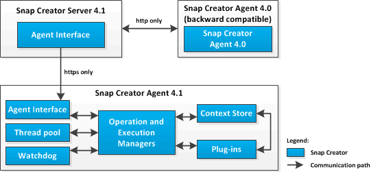

= Descripción general del agente de Snap Creator
:allow-uri-read: 
:icons: font
:imagesdir: ../media/

[role="lead"]
El agente de Snap Creator, que se suele instalar en el mismo host en el que se instala una aplicación o una base de datos, gestiona los comandos en modo inactivo y en modo inactivo desde el servidor de Snap Creator hasta una aplicación determinada y es donde se encuentran los complementos. A veces, el agente se reduce a scAgent dentro de Snap Creator.

El agente de Snap Creator recibe comunicación desde la interfaz del agente de Snap Creator Server a través de la interfaz de Agent RESTful, y solo a través de HTTPS. Esto se traduce en una comunicación segura y cifrada, lo que constituye una característica muy importante en los entornos multi-tenancy y cloud. Los certificados autofirmados permiten el uso de un certificado generado con el agente de Snap Creator. Además, el agente de Snap Creator está protegido por una combinación de usuario y contraseña configurable, que se almacena en el disco.

En la siguiente ilustración, se muestra la arquitectura del agente de Snap Creator:

El agente de Snap Creator (a veces acortado para scAgent dentro del propio Snap Creator) incluye las siguientes partes:

* *Gerentes de operación y ejecución*
+
El Gestor de operaciones se ocupa de las solicitudes entrantes, salientes y completadas. El Administrador de ejecución es responsable de ejecutar las solicitudes.

* * Piscina de subprocesos*
+
Formado por subprocesos de trabajo, el grupo de subprocesos se utiliza para ejecutar varias tareas.

+
Esto determina la cantidad de operaciones simultáneas en un momento determinado. Execution Manager ejecuta un plug-in y lo ejecuta en uno de los subprocesos del grupo de subprocesos. Si el grupo de subprocesos tiene ocho subprocesos, puede ejecutar ocho operaciones de plug-in simultáneamente. Las nuevas operaciones entrantes se pondrán en cola hasta que los subprocesos se liberen de nuevo.

* *Watchdog*
+
Desencadenado por el Administrador de ejecución para ciertas operaciones, normalmente en modo de inactividad, el Watchdog vuelve al Administrador de ejecución después de un tiempo especificado para detener la operación, si es necesario, y ejecuta una operación de deshacer correspondiente. Por ejemplo, la función de modo inactivo del plugin se llama para poner la aplicación en modo de backup. El vigilante comienza a escuchar. Si la función de inactividad no se ejecuta dentro de la ventana de tiempo especificada, el sistema Watchdog desquise la aplicación, volviendo a ponerlo en modo de funcionamiento normal. Esto es para garantizar que la base de datos no se quede bloqueada en modo de backup.

* *Almacén de contexto*
+
Si se mantiene toda la información necesaria durante la vida útil del flujo de trabajo, el almacén de contexto proporciona objetos de contexto al plugin según sea necesario y, si un flujo de trabajo falla o no se completa nunca, el objeto de contexto se elimina tras un período de tiempo.

+
Para los flujos de trabajo que no finalizan o fallan en un estado no definido, hay un tiempo de contexto máximo especificado en install_PATH/etc/agent.properties: CONTEXT_LIFÚTIL_IN_MSEC=1800000 (valor predeterminado, 30 minutos). Si se aumenta este valor, el agente de Snap Creator ocupa más memoria.

* *Fábrica de plug-in*
+
La fábrica del plugin inicia el plugin y garantiza que se ejecute en un espacio aislado. Plug-in Factory también se comunica con el almacén de contexto para acceder a la información almacenada. También permite ejecutar complementos nativos y basados en Perl de Snap Creator usando el motor de integración de complementos.

+
El agente de Snap Creator también puede utilizar plug-ins escritos en idiomas distintos de Java.

