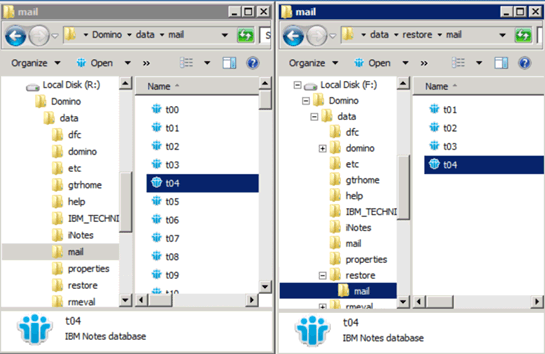

= Copia del archivo en el directorio de restauración de datos
:allow-uri-read: 
:icons: font
:imagesdir: ../media/

[role="lead"]
Después de montar la copia Snapshot del archivo que desea restaurar, puede copiar el archivo en el directorio de restauración de datos especificado en el archivo de configuración de copia de seguridad y restauración.

. Copie el archivo que se va a restaurar a partir de la copia snapshot montada.
. Pegue el archivo en el directorio de restauración de datos especificado en el archivo de configuración copia de seguridad y restauración.
+
En el ejemplo siguiente se muestra cómo se puede copiar el archivo de base de datos t04.nsf de la copia Snapshot montada en la unidad R: Al directorio de restauración de datos especificado en el archivo de configuración.

+

