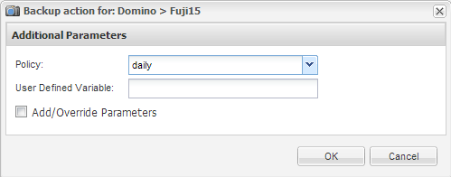

= Realizar backups de bases de datos bajo demanda
:allow-uri-read: 
:icons: font
:imagesdir: ../media/

[role="lead"]
Es necesario realizar backups de las bases de datos en cuanto estén disponibles en el almacenamiento de NetApp. Se pueden programar backups recurrentes después del backup inicial.

Debe haber creado el archivo de configuración para la copia de seguridad, como se describe en xref:task_using_the_gui_to_create_a_configuration_file.adoc[Crear un archivo de configuración].

. En el panel Perfiles y configuraciones, seleccione el archivo de configuración y haga clic en *acciones* > *copia de seguridad*.
. En el cuadro de diálogo parámetros adicionales, seleccione la directiva para el trabajo de copia de seguridad en el menú desplegable *Directiva* y haga clic en *Aceptar*.
+

+

NOTE: Debe haber configurado la política en el archivo de configuración.

+
SNAP Creator inicia el trabajo de backup. La información del trabajo se muestra en el panel Consola.

