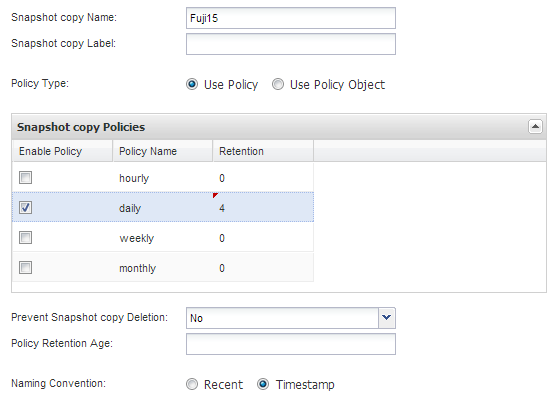

= Crear un archivo de configuración
:allow-uri-read: 
:icons: font
:imagesdir: ../media/

[role="lead"]
Para poder realizar una copia de seguridad de las bases de datos de IBM Domino, es necesario crear un archivo de configuración. El archivo de configuración es la entrada de operaciones de backup y restauración de Snap Creator.

Sólo se permiten los caracteres alfanuméricos y guiones bajos en los nombres de configuración y perfiles. Los nombres no pueden comenzar por un número.

TIP: Muchos sitios utilizan un archivo de configuración global en todo el sitio o en todo el perfil para aplicar información de credenciales del sistema de almacenamiento o de VMware a configuraciones de backup y restauración. Para obtener información detallada acerca de cómo crear un archivo de configuración global, consulte https://library.netapp.com/ecm/ecm_download_file/ECMP12395422["Guía de administración de Snap Creator Framework 4.1.2"].

. En el panel Perfiles y configuraciones, haga clic en *Agregar perfil*.
. En el cuadro de diálogo Nuevo perfil, introduzca el nombre del perfil y, a continuación, haga clic en *Aceptar*.
+
La creación de un nuevo perfil inicia automáticamente el asistente de configuración de Snap Creator Framework. Para agregar una nueva configuración a un perfil existente, haga clic con el botón secundario del ratón en el perfil y, a continuación, seleccione *Nueva configuración*.

+
En el asistente de configuración, haga clic en *Siguiente* para avanzar a la página siguiente y haga clic en *Atrás* para volver a la página anterior.

. En la página Configuration, escriba el nombre de la configuración y, a continuación, especifique si desea activar el cifrado de contraseña.
+
El cifrado de contraseña está habilitado de forma predeterminada para evitar que las contraseñas se muestren en texto sin cifrar en el archivo de configuración.

+

TIP: Coloque el cursor sobre un campo del asistente para mostrar una sugerencia de herramienta.

. En la página Plug-in Type, seleccione *Application Plug-in*.
. En la página Application Plug-ins, seleccione *IBM Domino*.
. En la página Plug-in parameters, especifique los detalles de la configuración de backup de IBM Domino:
+

NOTE: Los ejemplos de la siguiente tabla son para entornos UNIX. Puede ver ejemplos de la configuración de Windows en la captura de pantalla que sigue a la tabla.

+
|===
| Parámetro GUI | Parámetro CLI | Descripción 

 a| 
Directorio de datos de Domino
 a| 
RUTA DOMINO_DATA_
 a| 
La ruta al directorio de datos de Domino. Por ejemplo, /Domino/data.

 a| 
notes.ini Path
 a| 
DOMINO_INI_PATH
 a| 
La ruta al archivo notes.ini. Por ejemplo, /Domino/data/notes.inI.

 a| 
Cambiar el directorio de información
 a| 
DOMINO_CHANGE_ INFO_PATH
 a| 
La ruta de los archivos de intercambio. Por ejemplo, /chcambiinfo. *Importante:* Asegúrese de almacenar archivos de intercambio en un volumen distinto al volumen de datos de Domino.

 a| 
Tipo de backup
 a| 
DOMINO_ DATABASE_TYPE
 a| 
Los archivos de base de datos de los que se va a realizar una copia de seguridad Seleccione un valor en la lista desplegable GUI o especifique el número correspondiente en el comando CLI:

** Todo (recomendado) (CLI = 0)
** Archivos *.box (CLI= 1)
** Archivos *.nsf, *.nsg y *.nsh (CLI = 2)
** Archivos *.ntf (CLI = 3)

 a| 
Directorio de instalación de IBM Domino
 a| 
LOTUS
 a| 
La ruta al directorio donde están instalados los archivos binarios de Domino. En Linux, por ejemplo, /opt/ibm/domino (asumiendo la ruta de instalación predeterminada). En Windows, el primario del directorio Domino Shared Objects. *Nota:* esta no es la ruta a IBM Notes, anteriormente Lotus Notes.

 a| 
Ruta a los objetos compartidos de Domino
 a| 
Notes_ExecDirectory
 a| 
Ruta de acceso que contiene archivos de objetos compartidos de Domino (.so o .dll). Por ejemplo, /opt/ibm/domino/notes/latest/linux.

 a| 
Directorio de restauración de datos
 a| 
DOMINO_ RESTORE_DATA_ PATH
 a| 
Para las restauraciones de volúmenes (suponiendo que se está restaurando en la misma ubicación desde la que se realizó la copia de seguridad), la ruta del directorio de datos de Domino. Para las restauraciones de archivo único (solo NFS), una ubicación en el mismo volumen que el directorio de datos de Domino. Por ejemplo, /Domino/data/restore.

 a| 
Validar el directorio de datos de Domino
 a| 
VALIDAR_ RUTA DOMINO_DATA_
 a| 
Si el entorno Domino cuenta con varios puntos de montaje, algunos puntos de montaje pueden estar en un sistema de almacenamiento NetApp, mientras que otros pueden no estar disponibles. Seleccione un valor en la lista desplegable GUI o especifique el valor correspondiente en el comando CLI:

** Sí realiza una copia de seguridad de los archivos sólo en la ruta del directorio de datos Domino.
** No se realiza una copia de seguridad de todos los archivos del entorno Domino independientemente de su ubicación en el disco.

|===
+
El ejemplo siguiente muestra cómo puede completar los campos en un entorno Windows:

+
image::../media/scfs_domino_param_filled_in_windows.gif[Esta imagen se explica por el texto circundante.]

. En la página Configuración del agente, especifique la información de conexión del agente de Snap Creator:
+
|===
| Para este campo... | Realice lo siguiente... 

 a| 
IP/DNS
 a| 
Introduzca la dirección IP o el nombre de host DNS del host del agente de Snap Creator.

 a| 
Puerto
 a| 
Si no está utilizando el puerto predeterminado para Snap Creator Agent (9090), introduzca el número de puerto.

 a| 
Tiempo de espera (segundos)
 a| 
Deje el valor predeterminado.

|===
. Cuando esté satisfecho con las entradas, haga clic en *probar conexión de agente* para verificar la conexión con el agente.
+

NOTE: Si el agente no responde, compruebe los detalles del agente y confirme que la resolución del nombre de host funciona correctamente.

. En la página Storage Connection settings, especifique la información de conexión para la Storage Virtual Machine (SVM, anteriormente conocida como Vserver) en el sistema de almacenamiento principal:
+
|===
| Para este campo... | Realice lo siguiente... 

 a| 
Transporte
 a| 
Seleccione el protocolo de transporte para las comunicaciones con la SVM: HTTP o HTTPS.

 a| 
Puerto de la controladora/Vserver
 a| 
Si no utiliza el puerto predeterminado para la SVM (80 para HTTP, 443 para HTTPS), introduzca el número de puerto.

|===
+
*Nota:* para obtener información sobre cómo utilizar un proxy OnCommand, consulte https://library.netapp.com/ecm/ecm_download_file/ECMP12395422["Guía de administración de Snap Creator Framework 4.1.2"].

. En la página Controller/Vserver Credentials, especifique las credenciales para SVM en el sistema de almacenamiento primario:
+
|===
| Para este campo... | Realice lo siguiente... 

 a| 
Nombre o IP de la controladora/Vserver
 a| 
Introduzca la dirección IP o el nombre de host DNS del host de SVM.

 a| 
Usuario de controladora/Vserver
 a| 
Introduzca el nombre de usuario para el host de SVM.

 a| 
Contraseña de la controladora/Vserver
 a| 
Introduzca la contraseña del host de SVM.

|===
+
*Importante:* Si tiene previsto replicar copias Snapshot en un destino de SnapMirrror o SnapVault, el nombre de la SVM que introduzca en este paso debe coincidir exactamente con el nombre de la SVM que utilizó al crear la relación de SnapMirrror o SnapVault. Si especificó un nombre de dominio completo cuando creó la relación, debe especificar un nombre de dominio completo en este paso, independientemente de si SnapCreator puede encontrar la SVM con la información que proporcione. El caso es significativo.

+
Puede usar el comando snapmirror show para comprobar el nombre de la SVM en el sistema de almacenamiento principal:snapmirror show -destination-path destination_SVM:Destination_volume donde Destination_SVM_name es el nombre de la SVM en el sistema de destino y el volumen_destino es el volumen. Para obtener más información acerca de la creación de relaciones con SnapMirrror y SnapVault, consulte xref:concept_snapmirror_and_snapvault_setup.adoc[Configuración de SnapMirror y SnapVault].

+
Al hacer clic en *Siguiente*, aparece la ventana Controller/Vserver Volumes.

. En la ventana Controller/Vserver Volumes, especifique los volúmenes de los que se va a realizar la copia de seguridad arrastrando y soltando de la lista de volúmenes disponibles en el panel izquierdo a la lista de volúmenes de los que se va a realizar la copia de seguridad en el panel derecho y, a continuación, haga clic en *Guardar*.
+
Los volúmenes especificados se muestran en la página Controller/Vserver Credentials.

+

IMPORTANT: Si tiene previsto realizar una copia de seguridad del directorio chcambiinfo, debe configurar el volumen que contiene el directorio como volumen de metadatos, como se describe en xref:concept_use_meta_data_volumes_setting_to_back_up_the_changeinfo_directory.adoc[Hacer una copia de seguridad del directorio chcambiinfo]. Esta opción indica al complemento IBM Domino que cree una copia snapshot del volumen chcambiinfo _after_ creando la copia snapshot para los archivos de la base de datos.

. En la página Controller/Vserver Credentials, haga clic en *Add* si desea especificar los detalles de SVM y los volúmenes de los que se va a realizar una copia de seguridad para otro sistema de almacenamiento primario.
. En la página de detalles Snapshot, especifique la información para la configuración de Snapshot:
+
|===
| Para este campo... | Realice lo siguiente... 

 a| 
Nombre de la copia snapshot
 a| 
Introduzca el nombre de la copia Snapshot. *Sugerencia:* haga clic en *permitir copia Snapshot duplicada Nombre* si desea reutilizar los nombres de copia Snapshot en los archivos de configuración.

 a| 
Etiqueta de copia snapshot
 a| 
Introduzca un texto descriptivo para la copia Snapshot.

 a| 
Tipo de directiva
 a| 
Haga clic en *usar directiva* y, a continuación, seleccione las políticas de copia de seguridad integradas que desea que estén disponibles para esta configuración. Después de seleccionar una directiva, haga clic en la celda *retención* para especificar cuántas copias Snapshot con ese tipo de política desea conservar. *Nota:* para obtener información acerca de cómo utilizar objetos de directiva, consulte https://library.netapp.com/ecm/ecm_download_file/ECMP12395422["Guía de administración de Snap Creator Framework 4.1.2"].

 a| 
Evitar la eliminación de copias Snapshot
 a| 
Especifique Yes solo si no desea que Snap Creator elimine automáticamente copias de Snapshot que excedan el número de copias que se retendrán. *Nota:* especificar Sí puede hacer que usted exceda el número de copias snapshot por volumen soportadas.

 a| 
Edad de retención de la política
 a| 
Especifique la cantidad de días que desea retener las copias Snapshot que superan la cantidad de copias que se retendrán. Puede especificar una antigüedad de retención por tipo de política introduciendo el tipo de directiva:antigüedad, por ejemplo, diaria:15.

 a| 
Convención de nomenclatura
 a| 
Deje el valor predeterminado.

|===
+
La configuración especificada en el siguiente ejemplo realiza un backup diario y retiene cuatro copias Snapshot:

+

. En la página continuación de detalles de instantánea, defina *Omitir errores de aplicación* en Sí si desea forzar la operación de copia de seguridad para continuar incluso si una o más bases de datos se encuentran en un estado incoherente o dañado.
+
Debe ignorar los campos restantes.

+

TIP: Un entorno Domino puede consistir en cientos o miles de bases de datos. Si incluso una única base de datos está en estado incoherente o dañado, se producirá un error al realizar el backup. La activación de *Omitir errores de aplicación* permite continuar la copia de seguridad.

. En la página Data Protection, especifique si desea realizar una replicación de copias Snapshot opcional en el almacenamiento secundario:
+
.. Haga clic en *SnapMirror* para duplicar copias Snapshot.
+
La política para las copias Snapshot duplicadas es la misma que la de las copias Snapshot primarias.

.. Haga clic en *SnapVault* para archivar copias snapshot.
.. Especifique la política para las copias de Snapshot archivadas.
.. Las instrucciones se encuentran en el paso siguiente<<STEP_81795CF9D6294AC891BC3D0CE4827CA3,13>>.
.. En *tiempo de espera de SnapVault*, introduzca el número de minutos que desea que Snap Creator espere a que finalice la operación de SnapVault.
.. Debe haber configurado relaciones de SnapMirror y SnapVault antes de ejecutar la replicación en el almacenamiento secundario. Para obtener más información, consulte xref:concept_snapmirror_and_snapvault_setup.adoc[Configuración de SnapMirror y SnapVault].

. En la página Data Protection Volumes, haga clic en *Add* y, a continuación, seleccione la SVM para el sistema de almacenamiento primario.
+
Al hacer clic en *Siguiente*, aparece la ventana selección de volumen de protección de datos.

. En la ventana selección de volumen de protección de datos, especifique los volúmenes de origen que se van a replicar arrastrando y soltando de la lista de volúmenes disponibles en el panel izquierdo a la lista de volúmenes en las áreas SnapMirror y/o SnapVault del panel derecho y, a continuación, haga clic en *Guardar*.
+
Los volúmenes especificados se muestran en la página Data Protection Volumes.

. En la página Data Protection Volumes, haga clic en *Add* si desea especificar los detalles y volúmenes de SVM que se van a replicar para otro sistema de almacenamiento primario.
. En la página Data Protection Relationships, especifique las credenciales para el SVM en los sistemas de destino SnapMirrror y/o SnapVault.
. Si prefiere utilizar la API de OnCommand Unified Manager de NetApp en lugar de las API de Data ONTAP para las copias de Snapshot y las actualizaciones de SnapMirror/SnapVault, complete los campos de la página DFM/OnCommand Settings:
+
.. Haga clic en *Alerta de consola de Operations Manager* si desea recibir alertas de Unified Manager y, a continuación, introduzca la información de conexión necesaria para la máquina virtual de Unified Manager.
.. Haga clic en *funcionalidad de protección de datos de la consola de gestión de NetApp* si utiliza la función de protección de datos de la consola de gestión de NetApp para la replicación de SnapVault en 7-Mode y, a continuación, introduzca la información de conexión necesaria para el equipo virtual de Unified Manager.

. Revise el resumen y, a continuación, haga clic en *Finalizar*.

SNAP Creator enumera el archivo de configuración debajo del perfil especificado en el panel Perfiles y configuraciones. Puede editar la configuración seleccionando el archivo de configuración y haciendo clic en la ficha correspondiente del panel Contenido de configuración. Puede cambiar el nombre de la configuración haciendo clic en *Renombrar* en el menú contextual. Puede eliminar la configuración haciendo clic en *Eliminar* en el menú contextual.
