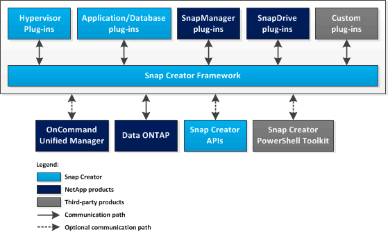

= Lo que hace Snap Creator Framework
:allow-uri-read: 
:icons: font
:imagesdir: ../media/

[role="lead"]
SNAP Creator Framework permite utilizar complementos personalizados y preconfigurados que normalicen y simplifiquen la protección de datos para una amplia variedad de aplicaciones de terceros, bases de datos e hipervisores en entornos de Windows y UNIX (AIX, HP-UX, Linux y Solaris).

SNAP Creator proporciona lo siguiente al aprovechar las funcionalidades de Snapshot, SnapVault, Open Systems SnapVault y SnapMirror, así como las funcionalidades de protección de datos de la consola de gestión de NetApp, la consola de Operations Manager y FlexClone:

* Protección de datos para aplicaciones
+
Una solución centralizada para realizar copias de seguridad de información crítica, que se integra con las arquitecturas de aplicación existentes para garantizar la coherencia de los datos y reducir los costes operativos.

* Capacidad de ampliación
+
Logre una integración rápida gracias a la arquitectura modular y la automatización basada en políticas.

* Disponible para cloud
+
Una funcionalidad de Snap Creator, independiente del sistema operativo, que admite plataformas físicas y virtuales, e interactúa con entornos DE cloud y DE TECNOLOGÍA como servicio.

* Funcionalidad de clonado
+
Se admite la clonado de datos con gestión eficiente del espacio para fines de desarrollo y pruebas.

En la siguiente ilustración, se muestran los componentes de Snap Creator Framework:

