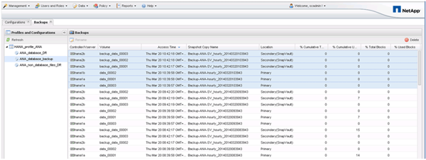

= Revisión de backups disponibles en SAP HANA Studio
:allow-uri-read: 
:icons: font
:imagesdir: ../media/

[role="lead"]
Puede ver la lista de backups de snapshot del almacenamiento en SAP HANA Studio.

En la copia de seguridad resaltada de la siguiente figura, se muestra una copia Snapshot llamada "'Backup-ANA_Hourly_20140320103943'". Este backup incluye copias Snapshot para los tres volúmenes de datos del sistema SAP HANA. La copia de seguridad también está disponible en el almacenamiento secundario.

Snap Creator utiliza el nombre de la copia de Snapshot como ID de backup cuando Snap Creator registra la copia de Snapshot del almacenamiento en el catálogo de backup de SAP HANA. En SAP HANA Studio, el backup de snapshot de almacenamiento se ve en el catálogo de backup. El identificador de backup externo (EBID) tiene el mismo valor que el nombre de la copia Snapshot, como se muestra en la siguiente figura.

image::../media/sap_hana_backup_catalog.gif[Esta imagen se explica por el texto circundante.]

Con cada backup ejecutado, Snap Creator elimina los backups de Snapshot en el almacenamiento primario y secundario en función de las políticas de retención definidas para las diferentes programaciones (por hora, por día, etc.).

SNAP Creator también elimina los backups del catálogo de backup de SAP HANA si no existe el backup en el almacenamiento principal o secundario. El catálogo de backup de SAP HANA siempre muestra la lista completa de backups disponibles en el almacenamiento principal y/o secundario.
