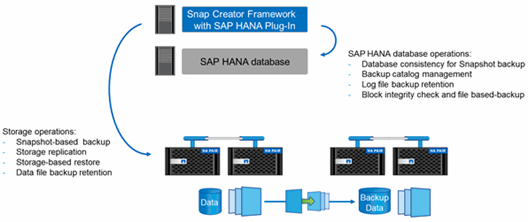

= Información general sobre el plugin de SAP HANA
:allow-uri-read: 
:icons: font
:imagesdir: ../media/

[role="lead"]
El complemento SAP HANA funciona junto con Snap Creator Framework para proporcionar una solución de backup para bases de datos SAP HANA que dependen del back-end de almacenamiento de NetApp Los backups de Snapshot creados por Snap Creator están registrados en el catálogo de HANA y se pueden ver en HANA Studio.

SNAP Creator Framework admite dos tipos de bases de datos de SAP HANA: Contenedores individuales y bases de datos de un solo inquilino (MDC).

SNAP Creator y el complemento de SAP HANA son compatibles con Data ONTAP en 7-Mode y Clustered Data ONTAP con los nodos de base de datos de SAP HANA conectados a las controladoras de almacenamiento mediante NFS o Fibre Channel. Las interfaces necesarias para la base de datos SAP HANA están disponibles para Service Pack Stack (SPS) 7 y versiones posteriores.

SNAP Creator Framework se comunica con los sistemas de almacenamiento para crear copias de Snapshot y replicar los datos a un almacenamiento secundario mediante SnapVault. SNAP Creator también se utiliza para restaurar los datos con SnapRestore en el almacenamiento principal o bien con SnapVault restore a partir del almacenamiento secundario.

El complemento de Snap Creator para SAP HANA utiliza el cliente hdbsql de SAP HANA para ejecutar comandos de SQL con el fin de proporcionar consistencia de la base de datos y gestionar el catálogo de backup de SAP HANA. El complemento SAP HANA es compatible con dispositivos de hardware certificados de SAP y programas de integración personalizada del centro de datos (TDI).

El complemento de Snap Creator para SAP HANA utiliza el cliente hdbsql de SAP HANA para ejecutar comandos SQL para las siguientes tareas:

* Proporcione consistencia de base de datos para preparar un backup de Snapshot basado en el almacenamiento
* Administrar la retención de copia de seguridad de archivos de registro a nivel de sistema de archivos
* Gestione el catálogo de backup de SAP HANA para backups de archivos de datos y archivos de registro
* Ejecute un backup basado en archivos para comprobar la integridad de los bloques

En la siguiente ilustración, se muestra una descripción general de las rutas de comunicación de Snap Creator con el almacenamiento y la base de datos SAP HANA.

SNAP Creator realiza los siguientes pasos para realizar un backup de la base de datos:

. Crea una copia snapshot de la base de datos SAP HANA para obtener una imagen uniforme en la capa de persistencia.
. Crea una copia snapshot de almacenamiento de los volúmenes de datos.
. Registra el backup de Snapshot de almacenamiento dentro del catálogo de backup SAP HANA.
. Elimina la copia snapshot de SAP HANA.
. Ejecuta una actualización de SnapVault para el volumen de datos.
. Elimina las copias Snapshot de almacenamiento en el almacenamiento primario y/o secundario en función de las políticas de retención definidas para backups en el almacenamiento principal y secundario.
. Elimina las entradas del catálogo de backup SAP HANA si los backups ya no existen en el almacenamiento principal y secundario.
. Elimina todos los backups de registros que sean más antiguos que el backup de datos más antiguo del sistema de archivos y dentro del catálogo de backup de SAP HANA.

