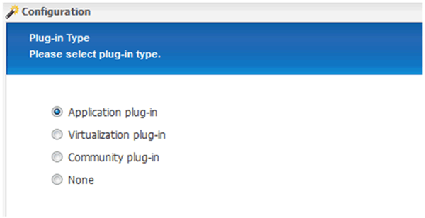
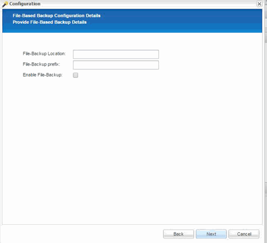

= Configurar el backup de la base de datos SAP HANA y Snap Creator Framework
:allow-uri-read: 
:icons: font
:imagesdir: ../media/

[role="lead"]
Debe configurar Snap Creator Framework y el backup de la base de datos SAP HANA.

. Conectarse a la interfaz gráfica de usuario (GUI) de Snap Creator: https://host:8443/ui/[].
. Inicie sesión con el nombre de usuario y la contraseña configurados durante la instalación. Haga clic en *Iniciar sesión*.
+
image::../media/snap_creator_gui.gif[Muestra el inicio de sesión de la interfaz gráfica de usuario de Snap Creator]

. Introduzca un nombre de perfil y haga clic en *Aceptar*.
+
image::../media/sap_hana_user_profile.gif[perfil de usuario de sap hana]

+
Por ejemplo, "'ANA'" es el SID de la base de datos.

. Introduzca el nombre de la configuración y haga clic en *Siguiente*.
+

. Seleccione *Application Plug-in* como tipo de plug-in y haga clic en *Siguiente*.
+

. Seleccione *SAP HANA* como complemento de aplicación y haga clic en *Siguiente*.
+
image::../media/sap_hana_select_application_plug_in.gif[sap hana select application plug-in]

. Introduzca los siguientes detalles de configuración:
+
.. Seleccione *Sí* en el menú desplegable para utilizar la configuración con una base de datos multi-tenant. Para una base de datos de contenedor único, seleccione *no*.
.. Si contenedor de base de datos multitenant está establecido en *no*, debe proporcionar el SID de la base de datos.
.. Si contenedor de base de datos multitenant está establecido en *Sí*, debe agregar las claves hdbuserstore para cada nodo SAP HANA.
.. Agregue el nombre de la base de datos de arrendatarios.
.. Añada los nodos HANA en los que se debe ejecutar la sentencia hdbsql.
.. Introduzca el número de instancia del nodo HANA.
.. Proporcione la ruta al archivo ejecutable hdbsql.
.. Agregue el usuario OSDB.
.. Seleccione *Sí* en la lista desplegable para activar el Liberador de espacio DE REGISTRO.
+
NOTA:

+
*** Parámetro `HANA_SID` está disponible solo si el valor para parámetro `HANA_MULTITENANT_DATABASE` se establece en `N`
*** Para contenedores de bases de datos multitenant (MDC) con un tipo de recurso "SingTenant", las copias Snapshot de SAP HANA funcionan con la autenticación basada en UserStore Key. Si la `HANA_MULTITENANT_DATABASE` el parámetro se establece en `Y`, a continuación, la `HANA_USERSTORE_KEYS` el parámetro debe estar configurado con el valor apropiado.
*** Al igual que con los contenedores de bases de datos que no son multi-tenant, se admite la función de backup basado en archivos y comprobación de integridad

.. Haga clic en *Siguiente*.

+
image::../media/file_based_backup_configuration.gif[configuración de backup basado en archivos]

. Active la operación de backup basado en archivos:
+
.. Establezca la ubicación de la copia de seguridad de archivos.
.. Especifique el prefijo de backup de archivos.
.. Seleccione la casilla de verificación *Activar copia de seguridad de archivo*.
.. Haga clic en *Siguiente*.
+

. Activar la operación Database Integrity Check:
+
.. Establezca la ubicación temporal de copia de seguridad de archivos.
.. Seleccione la casilla de verificación *Activar integridad de base de datos*.
.. Haga clic en *Siguiente*.

+
image::../media/integrity_checks.gif[Comprobación de integridad de la base de datos]

. Introduzca los detalles del parámetro de configuración del agente y haga clic en *Siguiente*.
+
image::../media/sap_hana_agent_configuration_parameter.gif[Esta imagen se explica por el texto circundante.]

. Introduzca la configuración de la conexión de almacenamiento y haga clic en *Siguiente*.
+
image::../media/sap_hana_storage_connect_gui.gif[Esta imagen se explica por el texto circundante.]

. Introduzca las credenciales de inicio de sesión de almacenamiento y haga clic en *Siguiente*.
+
image::../media/sap_hana_storage_login_credentials_gui.gif[Esta imagen se explica por el texto circundante.]

. Seleccione los volúmenes de datos almacenados en este controlador de almacenamiento y haga clic en *Guardar*.
+
image::../media/sap_hana_select_data_volumes.gif[Esta imagen se explica por el texto circundante.]

. Haga clic en *Agregar* para agregar otro controlador de almacenamiento.
+
image::../media/sap_hana_add_controller.gif[Esta imagen se explica por el texto circundante.]

. Introduzca las credenciales de inicio de sesión de almacenamiento y haga clic en *Siguiente*.
+
image::../media/sap_hana_storage_login_credentials2.gif[Esta imagen se explica por el texto circundante.]

. Seleccione los volúmenes de datos almacenados en el segundo controlador de almacenamiento que creó y haga clic en *Guardar*.
+
image::../media/sap_hana_controller_volumes_selection.gif[Esta imagen se explica por el texto circundante.]

. La ventana Controller/Vserver Credentials muestra las controladoras de almacenamiento y los volúmenes que añadió. Haga clic en *Siguiente*.
+
image::../media/sap_hana_view_storage_credentials.gif[Esta imagen se explica por el texto circundante.]

. Introduzca la política de Snapshot y la configuración de retención.
+
La retención de tres copias Snapshot diarias y ocho horas es solo un ejemplo y se puede configurar de manera diferente en función de los requisitos del cliente.

+

NOTE: Seleccione *Timestamp* como convención de nomenclatura. El uso de la convención de nomenclatura *Recent* no es compatible con el plugin SAP HANA, ya que la Marca de hora de la copia Snapshot también se usa para las entradas del catálogo de backup SAP HANA.

+
image::../media/sap_hana_snapshot_details_gui.gif[Esta imagen se explica por el texto circundante.]

. No es necesario realizar cambios. Haga clic en *Siguiente*.
+
image::../media/sap_hana_snapshot_details_continued_gui.gif[Esta imagen se explica por el texto circundante.]

. Seleccione *SnapVault* y configure las directivas de retención de SnapVault y el tiempo de espera de SnapVault.
+
image::../media/sap_hana_data_protection_gui.gif[Esta imagen se explica por el texto circundante.]

. Haga clic en *Agregar*.
+
image::../media/sap_hana_data_protection_volumes.gif[Esta imagen se explica por el texto circundante.]

. Seleccione un controlador de almacenamiento de origen de la lista y haga clic en *Siguiente*.
+
image::../media/sap_hana_dp_volumes_gui_select_storage_controller.gif[Esta imagen se explica por el texto circundante.]

. Seleccione todos los volúmenes almacenados en el controlador de almacenamiento de origen y haga clic en *Guardar*.
+
image::../media/sap_hana_volume_selection_gui.gif[Esta imagen se explica por el texto circundante.]

. Haga clic en *Agregar*, seleccione el segundo controlador de almacenamiento de origen de la lista y, a continuación, haga clic en *Siguiente*.
+
image::../media/sap_hana_configuration_data_protection_volumes_select_controller.gif[Esta imagen se explica por el texto circundante.]

. Seleccione todos los volúmenes que se almacenan en el segundo controlador de almacenamiento de origen y haga clic en *Guardar*.
+
image::../media/sap_hana_data_protection_volume_selection.gif[Esta imagen se explica por el texto circundante.]

. La ventana Data Protection Volumes muestra todos los volúmenes que deben protegerse en la configuración que ha creado. Haga clic en *Siguiente*.
+
image::../media/sap_hana_data_protection_volumes_gui.gif[Esta imagen se explica por el texto circundante.]

. Introduzca las credenciales de los controladores de almacenamiento de destino y haga clic en *Siguiente*. En este ejemplo, se utilizan las credenciales de usuario «'root'» para acceder al sistema de almacenamiento. Normalmente, se configura un usuario de backup dedicado en el sistema de almacenamiento y, a continuación, se utiliza con Snap Creator.
+
image::../media/sap_hana_data_protection_relationships_gui.gif[Esta imagen se explica por el texto circundante.]

. Haga clic en *Siguiente*.
+
image::../media/sap_hana_dfm_oncommand_settings_gui.gif[DFM/GUI de configuración de OnCommand. Esta imagen se explica por el texto circundante.]

. Haga clic en *Finalizar* para completar la configuración.
+
image::../media/sap_hana_data_protection_configuration_summary.gif[Esta imagen se explica por el texto circundante.]

. Haga clic en la ficha *Configuración de SnapVault*.
. Seleccione *Sí* en la lista desplegable de la opción *Restaurar espera* de SnapVault y haga clic en *Guardar*.
+
image::../media/sap_hana_snapvault_settings_gui.gif[Esta imagen se explica por el texto circundante.]

+
Es recomendable utilizar una red dedicada para el tráfico de replicación. Si decide hacerlo, debe incluir esta interfaz en el archivo de configuración de Snap Creator como una interfaz secundaria.

+
También puede configurar interfaces de gestión dedicadas para que Snap Creator pueda acceder al sistema de almacenamiento de origen o de destino mediante una interfaz de red que no está vinculada al nombre de host de la controladora de almacenamiento.

+
[listing]
----
mgmtsrv01:/opt/NetApp/Snap_Creator_Framework_411/scServer4.1.1c/engine/configs/HANA_profile_ANA
# vi ANA_database_backup.conf

#####################################################################
########################
#     Connection Options                                            #
#####################################################################
########################
PORT=443
SECONDARY_INTERFACES=hana1a:hana1a-rep/hana2b;hana1b:hana1b-rep/hana2b
MANAGEMENT_INTERFACES=hana2b:hana2b-mgmt
----

