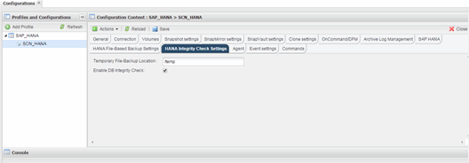

= Modificación de la configuración de comprobaciones de integridad de base de datos
:allow-uri-read: 
:icons: font
:imagesdir: ../media/

[role="lead"]
Puede modificar los parámetros configurados para comprobaciones de integridad de base de datos. La operación de comprobación de integridad programada o a petición posterior refleja la información actualizada.

. Haga clic en el perfil de SAP HANA.
. Seleccione la configuración que desea modificar y haga clic en *HANA Integrity Check Settings*.
+

. Edite la información y haga clic en *Guardar*.

