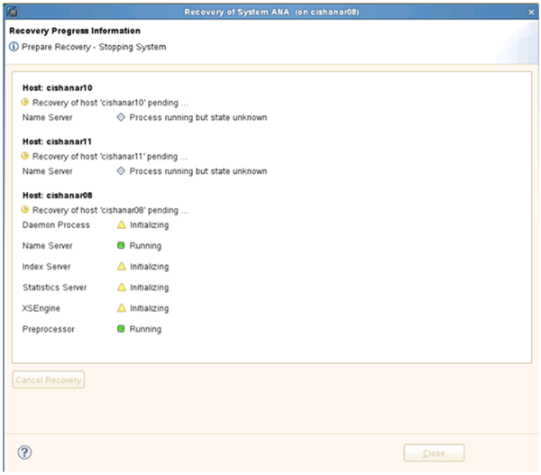

= Restaurar y recuperar bases de datos a partir de almacenamiento secundario
:allow-uri-read: 
:icons: font
:imagesdir: ../media/

[role="lead"]
Puede restaurar y recuperar la base de datos desde el almacenamiento secundario.

. En SAP HANA Studio, seleccione *Recover* para el sistema SAP HANA.
+
image::../media/sap_hana_recovery_secondary_storage_gui.gif[Esta imagen se explica por el texto circundante.]

+
El sistema SAP HANA se apagará.

. Seleccione el tipo de recuperación y haga clic en *Siguiente*.
+
image::../media/sap_hana_secondary_specify_recovery_type.gif[Esta imagen se explica por el texto circundante.]

. Proporcione ubicaciones de copia de seguridad de registros y haga clic en *Siguiente*.
+
image::../media/sap_hana_secondary_log_backup_locations.gif[Esta imagen se explica por el texto circundante.]

+
La lista de backups disponibles se muestra en función del contenido del catálogo de backups.

. Seleccione el backup y escriba el ID de backup externo requerido.
+
image::../media/sap_hana_recover_secondary_select_backup.gif[Esta imagen se explica por el texto circundante.]

. Vaya a la GUI de Snap Creator.
. Seleccione el sistema SAP HANA y, a continuación, haga clic en *acciones* > *Restaurar*.
+
image::../media/sap_hana_secondary_select_backup_restore.gif[Esta imagen se explica por el texto circundante.]

+
Aparece la pantalla de bienvenida.

+
image::../media/sap_hana_secondary_welcome_screen.gif[Esta imagen se explica por el texto circundante.]

. Haga clic en *Siguiente*.
. Seleccione *secundario* y haga clic en *Siguiente*.
+
image::../media/sap_hana_secondary_restore.gif[Esta imagen se explica por el texto circundante.]

. Especifique la información obligatoria. El nombre de Snapshot se correlaciona con el ID de backup que se ha seleccionado en SAP HANA Studio.
+
image::../media/sap_hana_select_backup_restore04_secondary_scf_gui.gif[Esta imagen se explica por el texto circundante.]

. Seleccione *Finalizar*.
+
image::../media/sap_hana_secondary_restore_summary.gif[Esta imagen se explica por el texto circundante.]

. Haga clic en *Sí* para agregar más elementos a restaurar.
+
image::../media/sap_hana_secondary_snapshot_settings_warning.gif[Esta imagen se explica por el texto circundante.]

. Proporcione la información requerida para todos los volúmenes que deben restaurarse. En el setup data_00001, data_00002 y data_00003 deben seleccionarse para el proceso de restauración.
+
image::../media/sap_hana_secondary_snapvault_restore.gif[Esta imagen se explica por el texto circundante.]

. Cuando todos los volúmenes estén seleccionados, seleccione *Aceptar* para iniciar el proceso de restauración.
+
Espere hasta que finalice el proceso de restauración.

. En cada nodo de base de datos, vuelva a montar todos los volúmenes de datos para limpiar «los «más comunes de NFS».
+
En el ejemplo, los tres volúmenes deben volver a montarse en cada nodo de la base de datos.

+
[listing]
----
mount -o remount /hana/data/ANA/mnt00001
mount -o remount /hana/data/ANA/mnt00002
mount -o remount /hana/data/ANA/mnt00003
----
. Vaya a SAP HANA Studio y haga clic en *Actualizar* para actualizar la lista de copias de seguridad.
+
image::../media/sap_hana_secondary_select_backup_to_recover.gif[Esta imagen se explica por el texto circundante.]

. El backup que se ha restaurado con Snap Creator se muestra con un icono verde en la lista de backups. Seleccione la copia de seguridad y haga clic en *Siguiente*.
. Seleccione otros ajustes según sea necesario y haga clic en *Siguiente*.
+
image::../media/sap_hana_secondary_other_settings.gif[Esta imagen se explica por el texto circundante.]

. Haga clic en *Finalizar*.
+
image::../media/sap_hana_secondary_review_recovery_settings.gif[Esta imagen se explica por el texto circundante.]

+
Se inicia el proceso de recuperación.

+

. Una vez finalizado el proceso de recuperación, reanude las relaciones de SnapVault si es necesario.
+
image::../media/sap_hana_secondary_recovery_execution_summary.gif[Esta imagen se explica por el texto circundante.]

