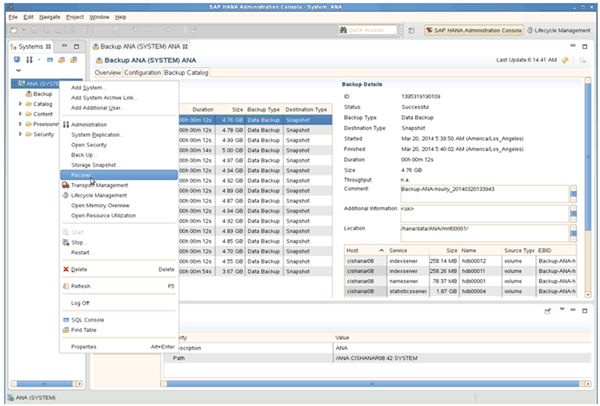
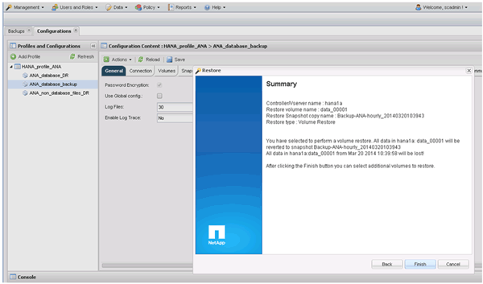
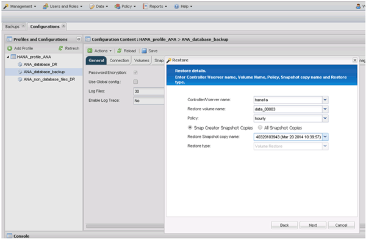

= Restaurar y recuperar bases de datos a partir del almacenamiento primario
:allow-uri-read: 
:icons: font
:imagesdir: ../media/

[role="lead"]
Es posible restaurar y recuperar la base de datos desde el almacenamiento primario.

NOTE: No puede restaurar copias de backup basadas en archivos desde Snap Creator.

. En SAP HANA Studio, seleccione *Recover* para el sistema SAP HANA.
+

+
El sistema SAP HANA se apaga.

. Seleccione el tipo de recuperación y haga clic en *Siguiente*.
+
image::../media/sap_hana_specify_recovery_type_gui.gif[Esta imagen se explica por el texto circundante.]

. Proporcione las ubicaciones de copia de seguridad de registros y haga clic en *Siguiente*.
+
image::../media/sap_hana_recover_primary_log_backup_location.gif[Esta imagen se explica por el texto circundante.]

+
La lista de backups disponibles que se muestra se basa en el contenido del catálogo de backup.

. Seleccione la copia de seguridad que desee y registre el ID de copia de seguridad externa.
+
image::../media/sap_hana_recovery_primary_select_backup.gif[Esta imagen se explica por el texto circundante.]

. Desactivar la relación de SnapVault.
+

NOTE: Este paso solo es necesario con Clustered Data ONTAP.

+
Si necesita restaurar una copia snapshot con una versión anterior a la copia de Snapshot que actualmente se utiliza como copia snapshot básica para SnapVault, primero debe desactivar la relación de SnapVault en Clustered Data ONTAP. Para ello, ejecute los siguientes comandos en la consola del clúster de backup:

+
[listing]
----
hana::> snapmirror quiesce -destination-path hana2b:backup_hana_data
Operation succeeded: snapmirror quiesce for destination hana2b:backup_hana_data.

hana::> snapmirror delete -destination-path hana2b:backup_hana_data
Operation succeeded: snapmirror delete the relationship with destination hana2b:backup_hana_data.

hana::> snapmirror release -destination-path hana2b:backup_hana_data
[Job 6551] Job succeeded: SnapMirror Release Succeeded
----
. En la GUI de Snap Creator, seleccione el sistema SAP HANA y, a continuación, seleccione *acciones* > *Restaurar*.
+
image::../media/sap_hana_select_restore_backup.gif[Esta imagen se explica por el texto circundante.]

+
Aparece la pantalla Bienvenido al Asistente para la restauración de Snap Creator Framework.

. Haga clic en *Siguiente*.
+
image::../media/sap_hana_primary_restore_welcome_screen.gif[Esta imagen se explica por el texto circundante.]

. Seleccione *Principal* y haga clic en *Siguiente*.
+
image::../media/sap_hana_primary_restore_primary_select.gif[Esta imagen se explica por el texto circundante.]

. Seleccione restore from primary Storage.
. Seleccione la controladora de almacenamiento, el nombre del volumen y el nombre de Snapshot.
+
El nombre de Snapshot se correlaciona con el ID de backup que se ha seleccionado dentro de SAP HANA Studio.

+
image::../media/sap_hana_select_backup_restore_scf_gui.gif[Esta imagen se explica por el texto circundante.]

. Haga clic en *Finalizar*.
+

. Haga clic en *Sí* para agregar más elementos de restauración.
+
image::../media/sap_hana_add_more_restore_items.gif[Esta imagen se explica por el texto circundante.]

. Seleccione la controladora de almacenamiento, el nombre del volumen adicional y el nombre de Snapshot.
+
El nombre de Snapshot se correlaciona con el ID de backup que se ha seleccionado dentro de SAP HANA Studio.

+

. Repita los pasos 10 a 13 hasta que se añadan todos los volúmenes requeridos; en nuestro ejemplo, data_00001, data_00002 y data_00003 deben seleccionarse para el proceso de restauración.
. Cuando todos los volúmenes estén seleccionados, haga clic en *Aceptar* para iniciar el proceso de restauración.
+
image::../media/sap_hana_select_volume_restore.gif[Esta imagen se explica por el texto circundante.]

+
Se inicia el proceso de restauración.

+
image::../media/sap_hana_primary_general_restore_process_in_progress.gif[Esta imagen se explica por el texto circundante.]

+
Espere hasta que finalice el proceso de restauración.

. En cada nodo de base de datos, vuelva a montar todos los volúmenes de datos para limpiar las asas NFS obsoletas.
+
En el ejemplo, los tres volúmenes deben volver a montarse en cada nodo de la base de datos.

+
[listing]
----
mount -o remount /hana/data/ANA/mnt00001
mount -o remount /hana/data/ANA/mnt00002
mount -o remount /hana/data/ANA/mnt00003
----
. Vaya a SAP HANA Studio y haga clic en *Actualizar* para actualizar la lista de copias de seguridad disponibles.
+
image::../media/sap_hana_primary_select_backup.gif[Esta imagen se explica por el texto circundante.]

+
El backup que se ha restaurado con Snap Creator se muestra con un icono verde en la lista de backups.

. Seleccione la copia de seguridad y haga clic en *Siguiente*.
+
image::../media/sap_hana_select_backup_to_recover_database.gif[Esta imagen se explica por el texto circundante.]

. Seleccione otros ajustes según sea necesario y haga clic en *Siguiente*.
+
image::../media/sap_hana_select_backup_other_settings.gif[Esta imagen se explica por el texto circundante.]

. Haga clic en *Finalizar*.
+
image::../media/sap_hana_primary_review_recory_settings.gif[Esta imagen se explica por el texto circundante.]

+
Se inicia el proceso de recuperación.

+
image::../media/sap_hana_primary_recovery_progress_information.gif[Esta imagen se explica por el texto circundante.]

. Una vez finalizada la recuperación, reanude las relaciones de SnapVault si es necesario.
+
image::../media/sap_hana_primary_recovery_execution_summary.gif[Esta imagen se explica por el texto circundante.]

